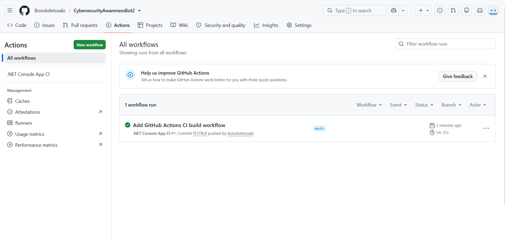

# Cybersecurity Awareness Bot

An interactive C# console application designed to teach cybersecurity fundamentals.

## Features
- Interactive quiz engine and response manager
- Custom ASCII graphics and colored UI
- Custom audio greeting player

## Setup & Execution
1. Clone the repository:
   ```bash
   git clone https://github.com/Bonololetsoalo/CybersecurityAwarenessBot2.git


 ## Continuous Integration (CI)


